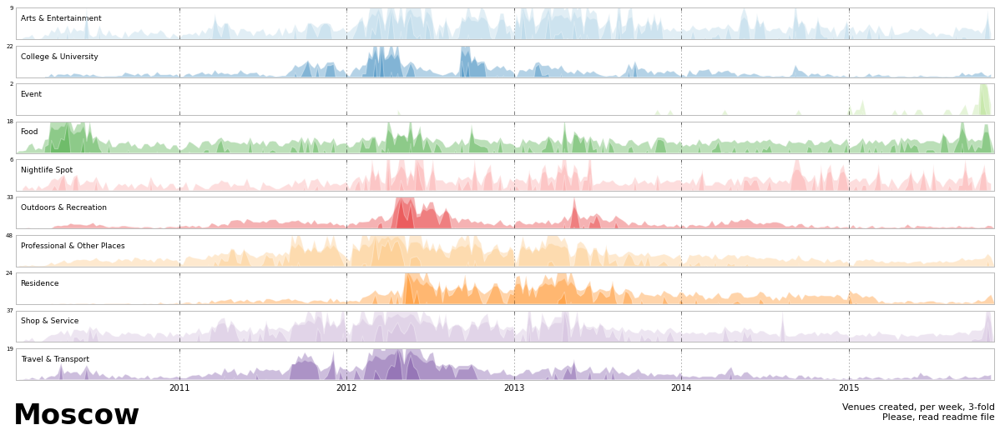

#Plot of pbk236

[link to plot](https://github.com/Casyfill/PUI2015_Philipp/blob/master/HW8/horisont_Moscow.png)

[link to description](https://github.com/Casyfill/PUI2015_Philipp/blob/master/HW8/README.md)

The plot: Time series, venues created, 3-fold.
Horisont Chart for Moscow

This plot was not in readme file as requested, but it could be found in the repository easily.

Review:

Plot itself is very beautiful, but a little hard to understand. It is a time series, which horizontal axis represents time, and it was divided in 10 subplots, each subplot represent , and they share the horizontal axis. Each vertical axis, one above the other with different colors, should represent the venues created in each city aspect. And when one plot has values higher than its vertical scale, this excess is added in the plot with a similar, but darker color to the original plot.

Each subplot has a number on the left upper corner that represent its venue (as fas as I can guess). As I can see in the plot, there is a big activity of created venues in year 2012.

The title, is ok to be in the bottom, but the information displayed (venues created) could be better together with the name of the city. The description is ok but not together with te plot. Maybe having the plot in the readme file could help to join the idea.

In this case the suggestion is to take advantage of the blank space and describe more clearly the plot.

