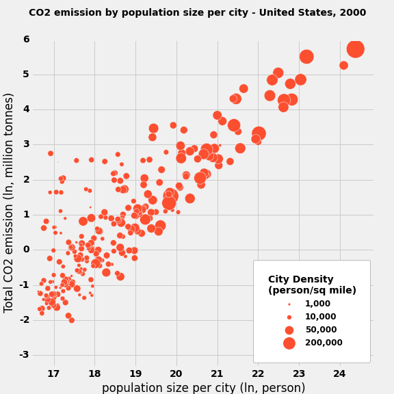

#Plot of ry692:

[link to plot](https://github.com/ramdaffe/PUI2015_ryanurzha/blob/master/HW8/plot.png)

The plot: carbon emissions vs. population size per city.
Cities of the United states, year 2000

This plot was not in readme file as requested, there was no readme file. But it was easily found.

Review:

At first sight, the plot is very easy to understand and informative, although the data is a little crowded. Its 2D axis are population (horizontal axis) and emissions (vertical axis). The data is displayed with markers of different sizes that represent cities. Each marker, which position establishes the population size and the emissions of the city, represents its density by its size.

Title is very descriptive, but it could have a bigger size, at least the same of the axis labels. In my opinion, it could use two lines to describe all basic information about the plot.

Axis Labels are good and descriptive, except for one small, but significant detail:  there is no logarithm base displayed. In the horizontal axis, if its largest value plotted is used with the "e" base to get the actual value, as intuitively anyone would guess, the result would be more than 3 times the actual population of the world, and in the plot there is data greater than that value.

For representing City density, it could have been used a color scale instead of a marker size. Marker size would confuse the perception of this dimension, because it doesn't describe the size of anything, but how agglomerated are people in a surface unit.

