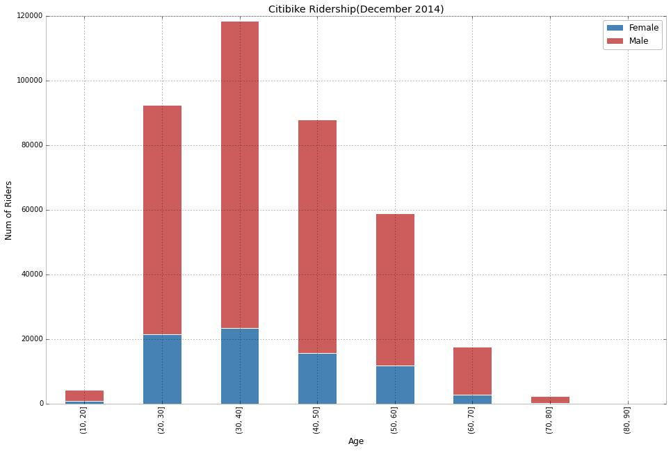

#Plot of sv1379

[link to ipython notebook with the plot](https://github.com/Sachinve/PUI2015_sverma/blob/master/HW8/HW8_PUI_sv1379_Assignment.ipynb)

The plot: Citibike Ridership for December 2014.

This plot was neither in a readme file, nor in a file as requested, it was the result of a ipython notebook and was part of it.

Review:

The plot is very easy to read and understand. Its 2D axis are Number of Rides (vertical axis) and Age (horizontal axis), divided in bins of 10 years each. The data is displayed in bars, each bar represent the number of rides with its height and its position in the horizontal axis determines which Age bin it belongs. There is a remarkable division of two colors in each bar, and according to the legend each color represent one gender.

Title is descriptive enough, it could have a bigger size.

Axis Labels are good and descriptive enough, they also could have a bigger size.

The plot is simple, and represent its data quite well and it is very understandable. The division in each bar shows very good information about its composition in gender.

As a suggestion, there could be some labels about the composition of each bar for example in %. But as it is, it is ok, but bigger font size for title and axis labels
